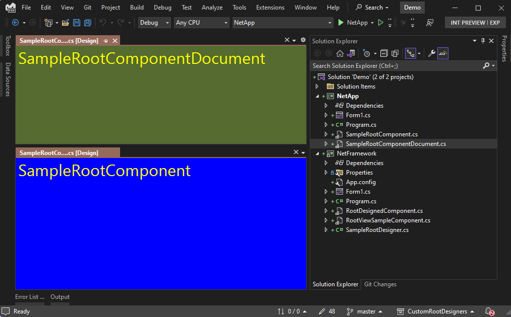

# Custom root designer demo

This sample shows how to build custom root designer for the Windows Forms out-of-process designer.



https://user-images.githubusercontent.com/4403806/195274386-f27314db-d4c5-48cd-bb5c-c1726c34a6f5.mp4


:exclamation: This sample requires Visual Studio 17.5.

## Solution structure

* `/src`
    * `CustomControl` project contains implementations of the custom root designers.
        - Various components which invoke the custom root designer located in `./Designers` folder
        - `/Designers`
            * `SampleRootComponentDesigner` a custom root designer based on [`ComponentDesigner`](https://docs.microsoft.com/dotnet/api/system.componentmodel.design.componentdesigner).
            * `SampleRootComponentDocumentDesigner` a custom root designer based on [`ComponentDocumentDesigner`](https://docs.microsoft.com/dotnet/api/system.windows.forms.design.componentdocumentdesigner).
            * `TestComponentDocumentDesigner` a custom implementation of `ComponentDocumentDesigner`.
    * `CustomControl.Client` project contains implementations of the proxies for the custom root designers used by Visual Studio.
        * `DesignerRoutingDefinitionProvider` facilitates mapping of the proxies to their respective concrete designers.
        * `SampleRootComponentProxyDesigner` a proxy for `SampleRootComponentDesigner`.
        * `SampleRootComponentDocumentProxyDesigner` a proxy for `SampleRootComponentDocumentDesigner`.
        * `TestComponentDocumentComponent` a proxy implementation of `TestComponentDocumentDesigner`.
    * `CustomControl.Package` project generates a NuGet package that can be used by the Windows Forms out-of-process designer.
    * `CustomControl.Protocol` project contains the custom control-specific notifications, etc.
* `/demo`
    * `NetFxApp` project targets .NET Framework 4.7.2 and shows the basic custom root designer functionality as described in https://docs.microsoft.com/dotnet/api/system.componentmodel.design.irootdesigner.
    * `NetApp` project targets .NET 6.0 and shows the same custom root designer functionality in the Windows Forms out-of-process designer referencing CustomControl.Package NuGet package.


## Build instructions

```cmd
dotnet build CustomRootDesigners.sln
start Demo.sln
```
